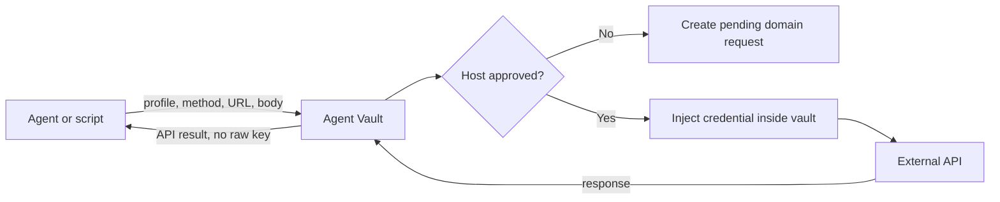
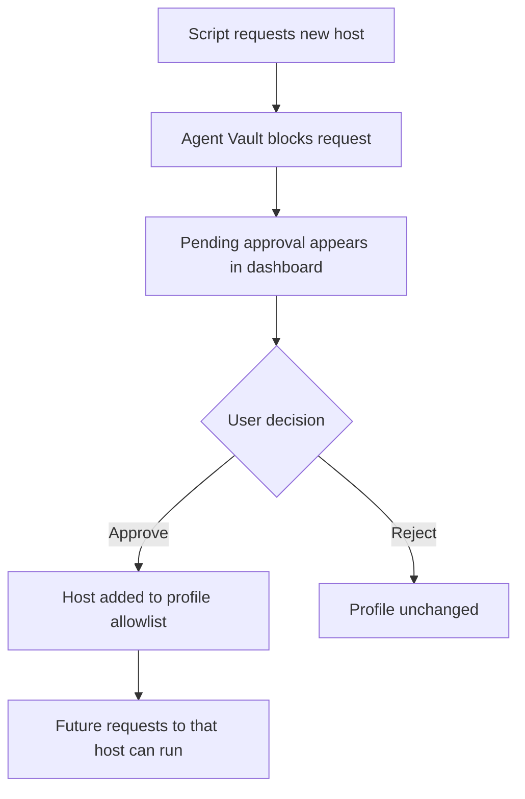

# Agent Vault

Agent Vault is a local password manager and API broker for AI agents.

Core rule:

```text
Agents may use API-backed capabilities, but agents must never receive, read, print, store, or pass around raw API credentials.
```

Agents see safe metadata and API responses. Agent Vault keeps the credentials, validates the destination, injects auth internally, and sends the request.

## How It Works



## Domain Approval



Path changes on an already approved host can be handled by scripts. Host changes need approval once.

## Quick Start

```bash
bin/s init
bin/s password change --auth
bin/s ls
```

Docker:

```bash
docker compose up --build
```

Open the dashboard:

```text
http://127.0.0.1:8787
```

The default master key is `password`. Change it immediately.

## Agent Usage

Agents should run with:

```bash
S_AGENT_MODE=1
```

Safe discovery:

```bash
S_AGENT_MODE=1 s ls
S_AGENT_MODE=1 s api ls
```

Safe API call:

```bash
S_AGENT_MODE=1 s api request BASECAMP \
  --method GET \
  --url https://3.basecampapi.com/example.json
```

Pending domains:

```bash
s api pending
s api approve REQUEST_ID
s api reject REQUEST_ID
```

## Storage

```text
vault.senv      encrypted vault data
master.json     verifier, wrapped vault key, recovery-code metadata
```

The raw master key is not stored. Recovery codes are printed once during setup or rotation. Store them separately from vault backups.

## Docs

- [Agent guide](docs/AGENT_README.md): what agents are allowed to do.
- [Security model](docs/SECURITY.md): boundaries, risks, and diagrams.
- [CLI usage](docs/CLI.md): command reference.
- [Web UI](docs/WEB.md): dashboard usage.
- [Docker usage](docs/DOCKER.md): container setup.
- [Threat model](docs/THREAT_MODEL.md): standing project requirement.

## Test

```bash
PYTHON=/mnt/DATA/AIW2/venv/bin/python scripts/smoke_cli.sh
```
