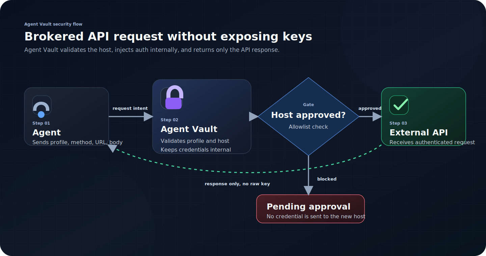
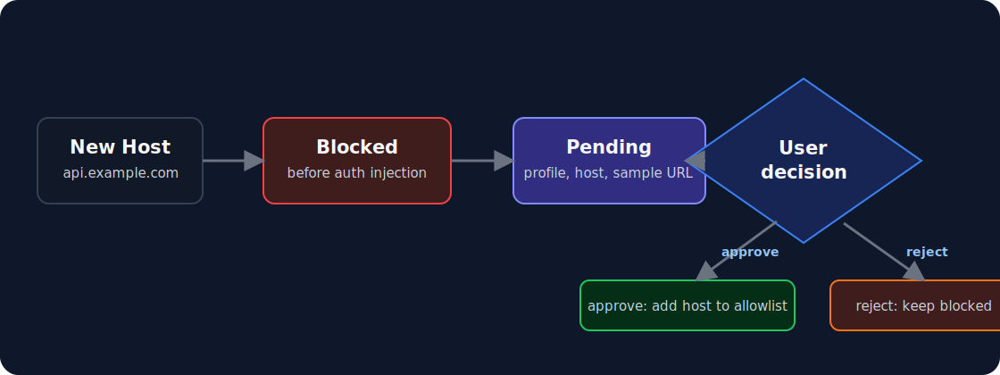

# Security Model

Agent Vault is single-user internal tooling for a trusted machine or private Tailscale network. It is not a shared password manager.

## Core Boundary

> *Agents may use API-backed capabilities, but agents must never receive raw credentials.*

Allowed:

- list safe metadata
- request API calls through approved profiles
- add or update values only when the user explicitly provides them
- archive old entries

Blocked in agent mode:

- raw reveal
- raw secret injection into subprocesses
- export
- delete, purge, rollback
- restore backup
- password or recovery changes

## API Broker



The agent never receives the API key. It only receives the API response.

## Domain Approval



Rules:

- Same host, new path: allowed if the profile already approves the host.
- New host: blocked until approved.
- Non-loopback HTTP: blocked unless the profile approves the exact internal origin through `allowed_http_origins`.
- Pending records store profile, host, sample URL, count, and timestamps.
- Pending records do not store raw secrets.

## Storage

```text
vault.senv      encrypted vault data
master.json     verifier, wrapped vault key, recovery-code metadata
```

The raw master key is not stored. The master key unwraps a random vault key. Changing the master key rewraps that vault key.

Recovery codes are printed once. Store them away from `vault.senv`, `master.json`, backups, chats, and agent context.

## Web UI

The dashboard requires the master key before reading metadata or changing vault state. The key is kept in browser session storage for the current browser session.

The web UI does not expose raw reveal, purge, rollback, or restore-backup.

## Network Exposure

Keep Agent Vault private:

- localhost for local use
- Tailscale for home-server use
- no direct public internet exposure

There is no multi-user auth, account lockout, public rate limiting, or external audit system.

## Remaining Risks

- A compromised host can attack the vault process or files.
- A malicious browser extension can read dashboard session storage.
- A human with the master key can intentionally export secrets.
- Human-only raw command injection remains risky by design.
- Agent Vault protects credentials, not the business logic of an API action.
- Safe metadata is visible after unlock.
