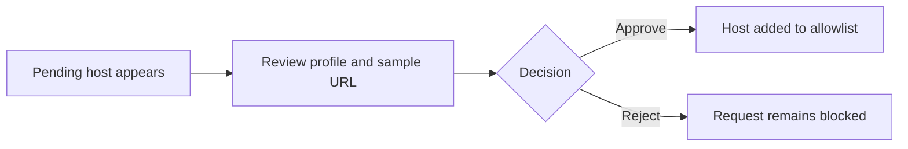

# Web UI

The dashboard is for Docker mode and private access only.

Start:

```bash
docker compose up --build
```

Open:

```text
http://127.0.0.1:8787
```

Default master key: `password`. Change it in the `Master key` tab.

## Tabs

- `Details`: view and edit safe metadata, update values, archive or restore items.
- `Add`: add secrets or notes.
- `Command`: add stored command templates.
- `API Profiles`: view approved hosts and approve or reject pending domains.
- `Master key`: rotate the dashboard master key.
- `Activity Log`: view audit metadata.

## Domain Approval



Approving a domain updates the API profile allowlist. It does not reveal secret values.

## Security Defaults

- Compose binds to `127.0.0.1:8787` by default.
- Metadata and mutation APIs require the dashboard unlock key.
- Raw reveal, delete, purge, rollback, and restore-backup are not exposed in the UI.
- Responses use `Cache-Control: no-store`.
- Request bodies are not logged by default.

Do not publish the dashboard directly to the internet. Use localhost or Tailscale.
